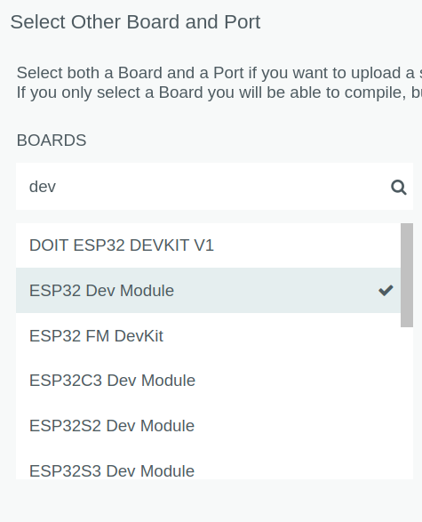

# RacingCar

## Introduction

This is a project about CUHK engine jyunhing 2022 (香港中文大學工程學院學生慶祝活動2022).  
The instagram page is [@22engine_jyunhing](https://www.instagram.com/22engine_jyunhing/)  
This project aims to build a remote racing car with 2 ESP-32 and controlled by handmade controller via WIFI.  

## Component

- Arduino IDE v2
- Motor x 2
- ESP32(ICC: ) x 2
- Motor Driver(Model: ) x 1
- Joystick x 1
- Button x 2

## Environment

- The code is written under linux (Arch 6.0.2), but Windows 10/11 and MacOS should also work.
- This project is done under Arduino IDE == 2.0.1, but Arduino IDE >= 2.0.0 should be fine to run this project.
- Install Arduino IDE and driver (CP210) from [offical website](https://www.arduino.cc/en/software).
- Install library for ESP32, this project is done with library version == 2.0.5
  1. In your Arduino IDE, go to `File > Preferences`
  2. Paste the link below into `Additional Board Manager URLs` field:
   ``
   https://raw.githubusercontent.com/espressif/arduino-esp32/gh-pages/package_esp32_index.json
   ``
   
  3. Then go to `Tools > Board > Boards Manager`
  4. Search esp32 and install required library (There should only be one result)
  

- Select the correct board module, We use `ESP32 Dev Module` for this project.
  
  

## Hardware connection

WIP
