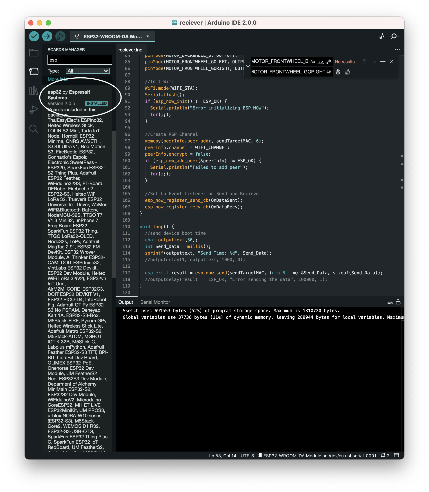
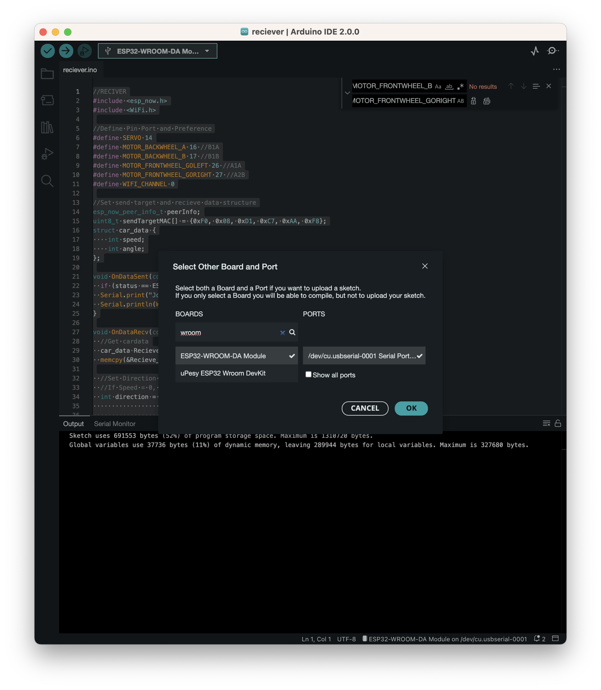

# RacingCar

## Introduction

This is a project about engine jyunhing 2022. The instagram page is [@22engine_jyunhing](https://www.instagram.com/22engine_jyunhing/)

* 香港中文大學工程學院學生慶祝活動2022

## Environment

* In your Arduino IDE, go to File > Preferences

* Installing ESP32 Add-on in Arduino IDE Windows, Mac OS X, Linux open preferences
Enter the following into the “Additional Board Manager URLs” field:

``https://raw.githubusercontent.com/espressif/arduino-esp32/gh-pages/package_esp32_index.json``

